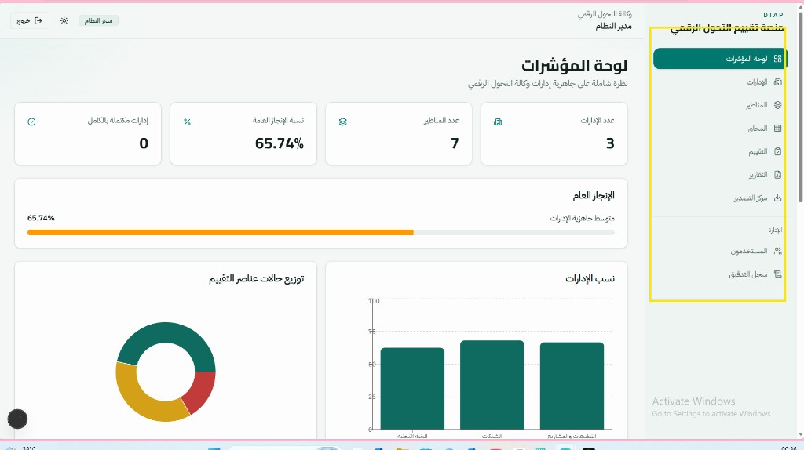

# Digital Transformation Assessment Platform (DTAP)

منصة ويب احترافية لإدارة وتقييم **جاهزية الإدارات** التابعة لوكالة التحول الرقمي.



## نظرة عامة

يتيح النظام إدارة هيكل التقييم وإدخال النتائج واحتساب النسب تلقائياً، مع تقارير وتصدير احترافي بصيغ PDF و Excel و CSV.

### الإدارات المدعومة (Seed)

1. إدارة البنية التحتية  
2. إدارة الشبكات  
3. إدارة التطبيقات والمشاريع  

### هيكل التقييم

```text
الإدارة
 └─ المنظور (Perspective)
     └─ المحور (Domain)
         └─ عناصر التقييم (Assessment Items)
```

### قواعد الاحتساب

| الحالة | النسبة |
|--------|--------|
| غير مطبق | 0% |
| قيد التنفيذ | 50% |
| مكتمل | 100% |

- نسبة المحور = متوسط عناصره  
- نسبة المنظور = متوسط محاوره  
- نسبة الإدارة = متوسط مناظيرها  
- إذا اكتملت كل المناظير → الحالة: **مكتمل بالكامل**

## المميزات

- لوحة مؤشرات تفاعلية (KPI + Charts)
- إدارة الإدارات / المناظير / المحاور
- صفحة تقييم مع حفظ تلقائي وتحديث فوري للنسب
- تقارير: إنجاز، فجوات، محاور، إدارات
- مركز تصدير: PDF / Excel / CSV
- صلاحيات: Admin / Assessor / Viewer
- سجل تدقيق (Audit Logs)
- واجهة عربية RTL + Dark/Light Mode

## التقنيات

- **Frontend:** Next.js 15, TypeScript, Tailwind CSS, Shadcn UI, Recharts  
- **Backend:** Next.js API Routes, Auth.js (Credentials)  
- **Database:** PostgreSQL + Prisma ORM  

## التشغيل السريع

### Docker Compose

```bash
docker compose up -d
cp .env.example .env
npm install
npm run db:setup
npm run dev
```

### PostgreSQL محلي (Windows)

```bash
npm run db:start
npm install
npm run db:setup
npm run dev
```

ثم افتح: [http://localhost:3000](http://localhost:3000)

## حسابات تجريبية

| الدور | البريد | كلمة المرور |
|------|--------|-------------|
| Admin | `admin@dtap.local` | `Admin@123` |
| Assessor | `assessor@dtap.local` | `Assessor@123` |
| Viewer | `viewer@dtap.local` | `Viewer@123` |

## هيكل الصفحات

| المسار | الوصف |
|--------|--------|
| `/dashboard` | لوحة المؤشرات |
| `/departments` | الإدارات |
| `/perspectives` | المناظير |
| `/domains` | المحاور |
| `/assessment` | إدخال التقييم |
| `/reports` | التقارير |
| `/export` | مركز التصدير |
| `/admin/users` | المستخدمون (Admin) |
| `/admin/audit` | سجل التدقيق (Admin) |

## أوامر مفيدة

```bash
npm run db:migrate
npm run db:seed
npm run build
npm run start
```

---

**DTAP** — Digital Transformation Assessment Platform
